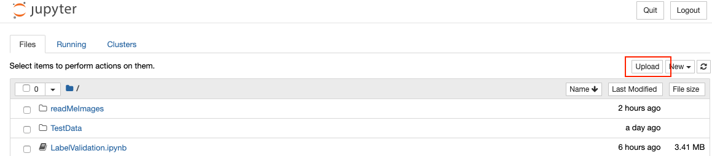
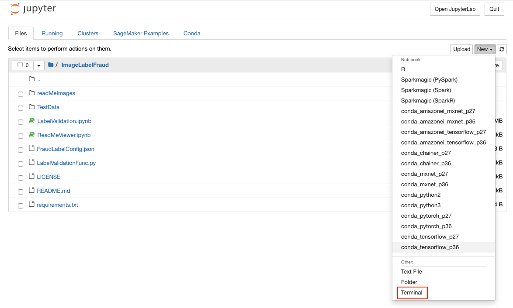
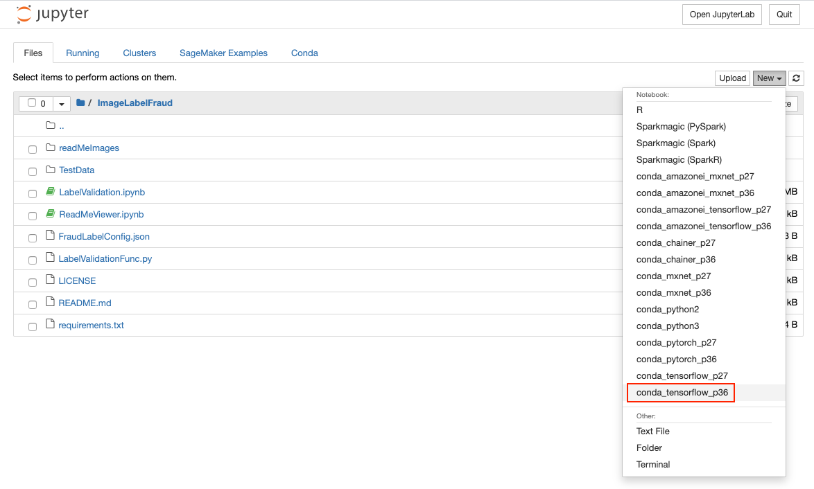

# Fraudulent Image Detections
This notebook is used to demonstrate our capabilities to identify images which are closly related and could constitute a fradulent image label or identify a trademark violation of an organzation's IP.

# Configure and run the Notebook in AWS Sagemaker

- From the SageMaker Homepage select the notebook instance and then "Open Jupyter"

- Inside the Jupyter Notebook "Upload" LabelValidation.ipynb, LabelValidationFunc.py, FraudLabelConfig.json, and all images from TestData directory. 
- NOTE: Be certain all images are uploaded under a TestData directory in you SageMake Jupyter instance.

- Also, you may need to select 'Upload' button twice to upload your files properly.

- As an easier method, zip the existing TestData directory and upload the zip file

  

# Unzip TestData.zip in a SageMaker terminal

- Open a terminal
- Go to the terminal, cd to SageMaker, unzip the labelImages - `unzip labelImages.zip`
- Click to open LabelValidation.ipynb

 

# When in  Jupyter Notebook, use the "conda_tensorflow_p36" kernel
- If UI asks to select Kernel upon opening notebook, enter X, and cancel
- Make certain that you are using the correct kernel "conda_tensorflow_p36" kernel

  

  

