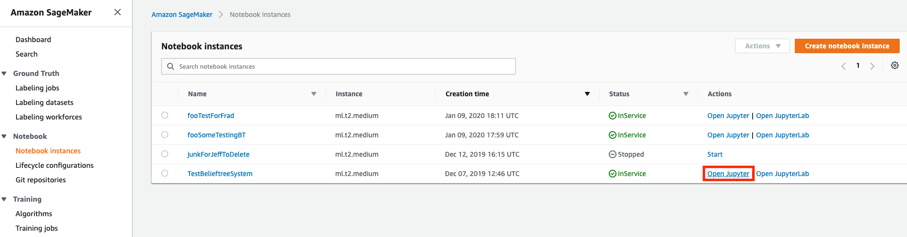
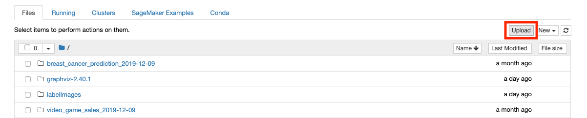
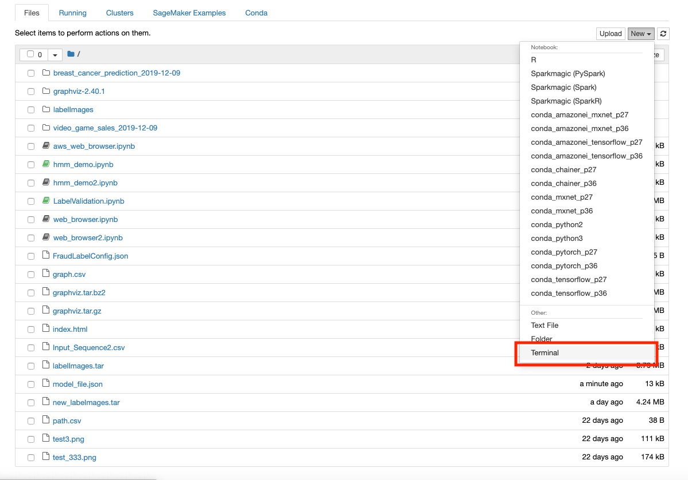
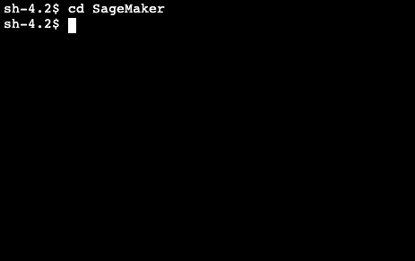
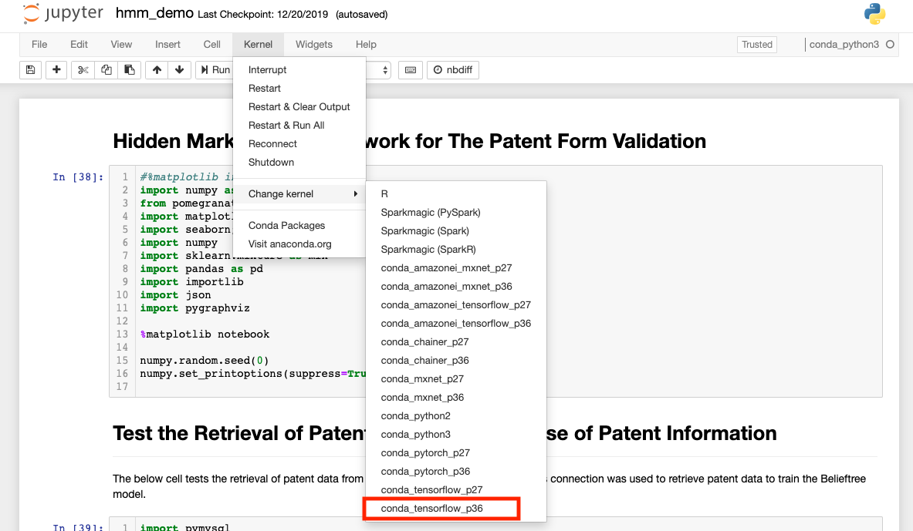
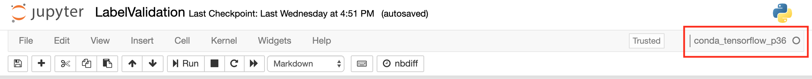

# ML_FraudDetections
Used for the TTB efforts to detect fraudulent labels and formulas

# Instructions to configure LabelValidation.ipynb locally
- It is highly recommended to use a conda or other virtual environment when running this project to avoid any potential conflicts
- Install Anaconda or conda for your operating system [here](https://docs.anaconda.com/anaconda/install/)
- In the root directory of the project create a new conda environment using `conda create --name <your_env_name>`
- Activate that environment using `conda activate <your_env_name>`
- While also in the root directory of the project, run `pip3 install -r requirements.txt`

# Configure to run in Sagemaker
- From the SageMaker Homepage select "Open Jupyter"
- Inside the Jupyter Notebook "Upload" LabelValidation.ipynb, LabelValidationFunc.py, FraudLabelConfig.json, and create labelImages.tar from TestData directory
- Select Upload twice to upload properly

  

  

  

# Untar labelImages.tar in a terminal
- Open a terminal
- Go to the terminal, cd to SageMaker, `mkdir TestData`, and in TestData `tar xvf labelImages.tar`
- Click to open LabelValidation.ipynb

  

  

# When in  Jupyter Notebook, use the "conda_tensorflow_p36" kernel
- If UI asks to select Kernel upon opening notebook, enter X, and cancel
- Make certain that you are using the correct kernel "conda_tensorflow_p36" kernel

  

  

# Instructions to configure FormulaFraudDetection.ipynb locally
- It is highly recommended to use a conda or other virtual environment when running this project to avoid any potential conflicts
- Install Anaconda or conda for your operating system [here](https://docs.anaconda.com/anaconda/install/)
- In the root directory of the project create a new conda environment using `conda create --name <your_env_name>`
- Activate that environment using `conda activate <your_env_name>`
- While also in the root directory of the project, run `pip3 install -r requirements.txt`

# From the SageMaker Homepage select "Open Jupyter"
- From the Jupyter Notebook "Upload" FormulaFraudDetection.ipynb, and create formula_fraud.tar from TestData directory
- Select Upload twice to upload properly

  

  

  

# Untar formula_fraud.tar in a terminal
- Open a terminal
- Go to the terminal, cd to SageMaker, mkdir TestData, and in TestData tar xvf formula_fraud.tar
- Click to open FormulaFraudDetection.ipynb

  

  

# When in  Jupyter Notebook, need to use the conda_python3 kernel
- If UI asks to select Kernel upon opening notebook, enter X, and cancel
- Make certain that you are using the correct kernel "conda_tensorflow_p36" kernel

  
