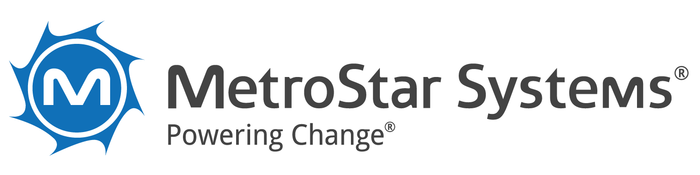
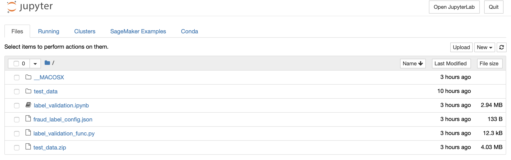
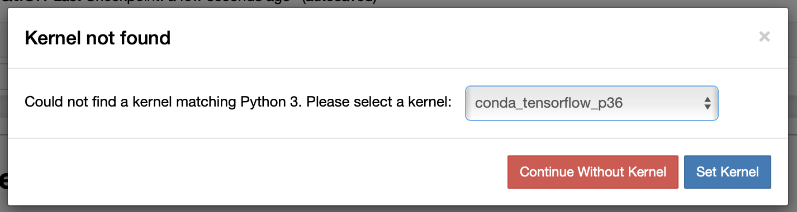

MetroStar Systems provides information technology services and consulting primarily to government clients. MetroStar's service portfolio includes leading and emerging technology solutions through their Cyber, Digital, and Enterprise IT practice areas. 

# Fraudulent Image Detections

The Fraudulent Image Detections repository uses deep learning to identify if and how closely a newly passed image mimics one that is a part of the pre-determined trademarked labels dataset. The deep learning model uses one shot system to classify whether an image is fraudulent. You can run the model locally or in AWS Sagemaker.

**Trademarked Label:** 


**Detected Fraudulent Labels:**


### Takeaways

The technique illustrated in the repository can be easily replicated for fraudulent image detection and/or similarity scoring of any image(s) you insert against a pre-determined set of images dataset. 

Sample Use Cases:

1. Determining fraudulent company logos 
2. Doppelgänger similarity scoring

## File Overview

- read_me_images: This directory holds the images used in the README.md file
- test_data: This directly holds all the images needed to run the notebook.
- fraud_label_config.json: This file contains configuration for the label detection process.
- label_validation.ipynb: This is the main jupyter notebook that runs the deep learning model.
- label_validation_func.py: This python file contains the methods that performs the label detection.
- requirements.txt: This text file holds all the requirements needed in order to run the notebook.
- test_label_validation.py: This is the unit testing file.

## To Run the Notebook Locally

#### Pre-Requisites

- You will need to download the repository
- You will need conda and pip installed

#### Configure the Local Environment

**If using Conda:**

1. Create a new conda environment called `ImageLabelDuplicateDetection_dev`:

```
conda env create -f environment.yml
```

2. Activate the Environment.

```
conda activate ImageLabelDuplicateDetection_dev
```

3. Move into the dowloaded repository's directory.
4. Install the test dependencies.

```
conda install pytest
```

```
pytest test_label_validation.py
```

5. Open up Jupyter Notebook.

```
jupyter notebook
```

6. Click the label_validation.ipynb notebook.

**You should now be able to run the notebook!**


**If using Pip:**

1. Create a new virtual environment.

```
conda create --name ImageLabelDuplicateDetection_dev python=3.7
```

```
conda activate ImageLabelDuplicateDetection_dev
```

2. Move into the downloaded repository's directory. 
3. Install the requirements needed to successfully run the notebook.

```
pip install -r requirements.txt
```

4. Install the test dependencies.

```
conda install pytest
```

```
pytest test_label_validation.py
```

5. Move into the downloaded directory in the terminal and open Jupyter notebook.

```
pip install jupyter
```

```
jupyter notebook
```

6. Click the label_validation.ipynb notebook.

**You should now be able to run the notebook!**

## To Run the Notebook in AWS Sagemaker

Before starting, zip the test_data directory.

1. Create a notebook instance.
2. After starting the notebook instance, upload the following files from the downloaded folder:
   - label_validation.ipynb
   - label_validation_func.py
   - fraud_label_config.json
   - test_data.zip 

3. Open the terminal and unzip the test_data.zip file.

```
unzip test_data.zip
```

4. Open the label_validation.ipynb and when prompted, select "conda_tensorflow_p36" as the kernel.

**You should now be able to run the notebook!**

## Licensing

MIT

Please Reference the licensing.md file for more information.
