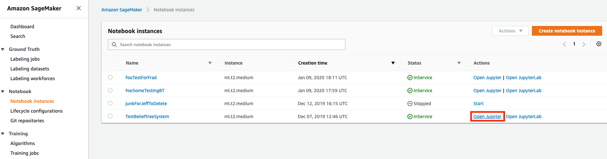
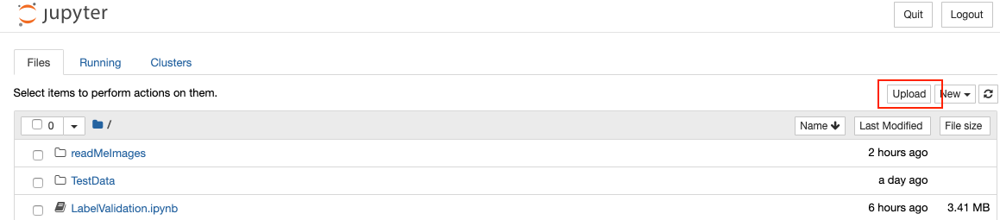
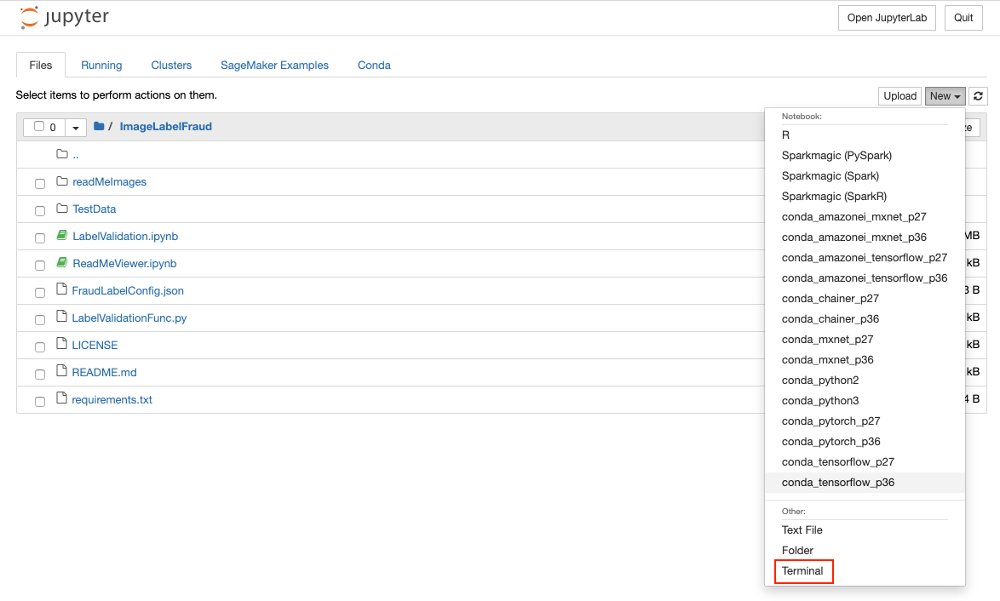
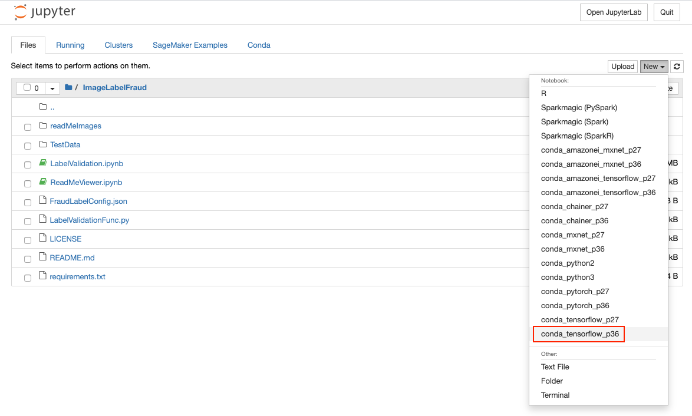
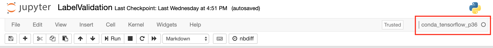

# Fraudulent Image Detections
This notebook is used to demonstrate our capabilities to identify images which are closly related and could constitute a fradulent image label or identify a trademark violation of an organzation's IP.

# Getting Started
## Local environment

```
conda create --name ImageLabelDuplicateDetection_dev python=3.7
conda activate ImageLabelDuplicateDetection_dev
pip install Keras==2.3.1
pip install Keras-Applications==1.0.8 
pip install Keras-Preprocessing==1.1.0
pip install numpy==1.17.5
pip install Pillow==6.2.0
pip install scipy==1.3.1
pip install seaborn==0.9.0
pip install tensorboard==2.0.0
pip install tensorflow==2.0.0
pip install tensorflow-estimator==2.0.1
conda install jupyter
```

The above command will create a local conda environment called `ImageLabelDuplicateDetection_dev`. To run the test suite, we need to bring in additional dependencies by installing `pytest` as follows:
```
conda install pytest
```

## Configure and run the Notebook in AWS Sagemaker

- From the SageMaker Homepage select the notebook instance and then "Open Jupyter"




- Inside the Jupyter Notebook "Upload" LabelValidation.ipynb, LabelValidationFunc.py, FraudLabelConfig.json, and all images from TestData directory. 
- NOTE: Be certain all images are uploaded under a TestData directory in you SageMake Jupyter instance.

- Also, you may need to select 'Upload' button twice to upload your files properly.

- As an easier method, zip the existing TestData directory and upload the zip file




<br/><br/>


### Unzip TestData.zip in a SageMaker terminal

- Open a terminal
- Go to the terminal, cd to SageMaker, unzip the labelImages - `unzip labelImages.zip`
- Click to open LabelValidation.ipynb



<br/>


### When in  Jupyter Notebook, use the "conda_tensorflow_p36" kernel
- If UI asks to select Kernel upon opening notebook, enter X, and cancel
- Make certain that you are using the correct kernel "conda_tensorflow_p36" kernel


<br/><br/>


<br/><br/>


